# KIEN TRUC HE THONG VA SO DO THUAT TOAN CIRCUITTH

Tai lieu nay mo ta kien truc va luong xu ly cua CircuitTH theo code hien tai.

## 1. Kien truc he thong

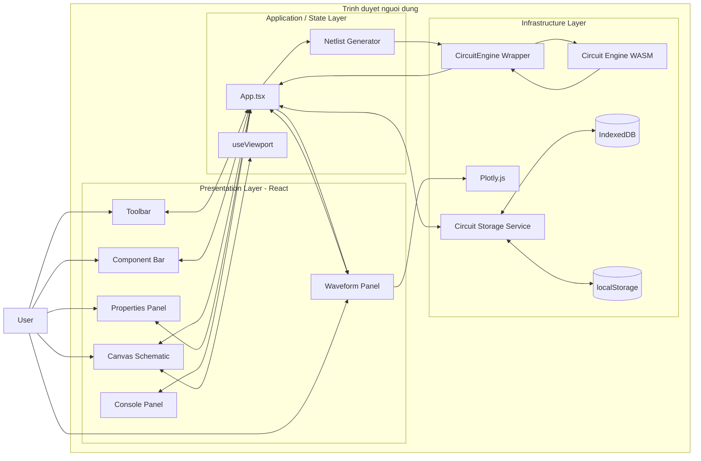

### Phan tach trach nhiem

| Tang | Module chinh | Trach nhiem |
|---|---|---|
| Giao dien | `Toolbar`, `Sidebar`, `Canvas`, `PropertiesPanel`, `WaveformPanel` | Nhan thao tac va hien thi |
| Dieu phoi | `App.tsx` | Quan ly state, file mach, cau hinh va mo phong |
| Do hoa schematic | `Canvas.tsx`, `useViewport.ts` | Ve, hit-test, pan, zoom, dat linh kien va day |
| Bien dich mach | `netlist.ts`, `unionFind.ts` | Xac dinh node dien va sinh netlist |
| Giai mach | `circuitEngine.ts`, WASM | Chay OP, DC, AC, TRAN |
| Truc quan hoa | `WaveformPanel.tsx`, Plotly | Ve OP, DC Sweep, DC Y-X, Bode va Transient |
| Luu tru | `circuitStorage.ts` | Autosave va quan ly nhieu file mach trong IndexedDB |

---

## 2. Flowchart muc 1 - Tong quan chuong trinh


---

## 3. Flowchart muc 2 - Theo muc goi ham

### 3.1 Khoi dong va luu file mach

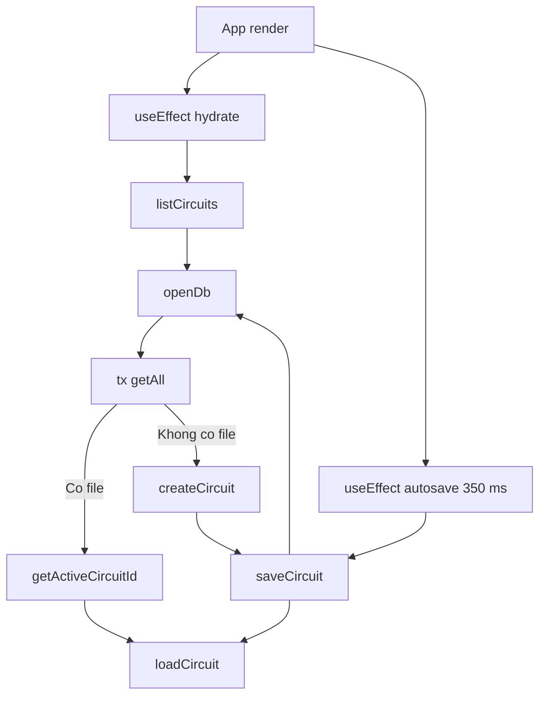

### 3.2 Chinh sua schematic

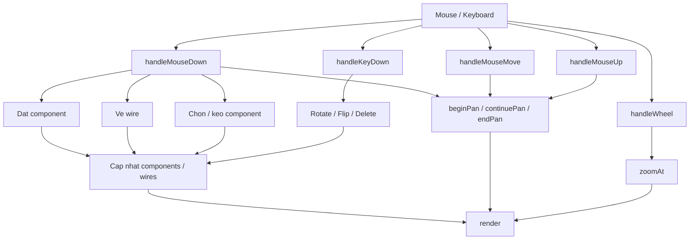

### 3.3 Chay mo phong

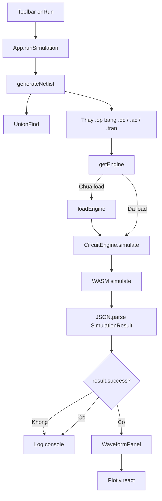

### 3.4 Quan he cac component React

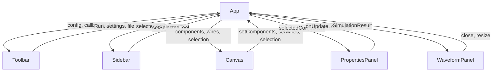

---

## 4. Flowchart muc 3 - Chi tiet tung nhom ham

### 4.1 `App.runSimulation()`


### 4.2 `generateNetlist()`


### 4.3 `Canvas.handleMouseDown()`


### 4.4 `Canvas.render()`

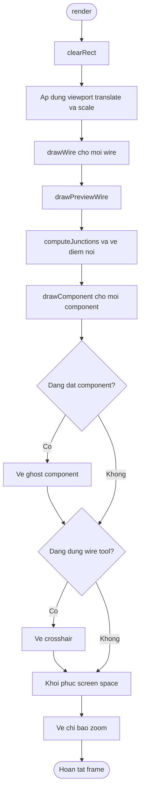

`drawComponent()` dieu phoi cac ham ve:

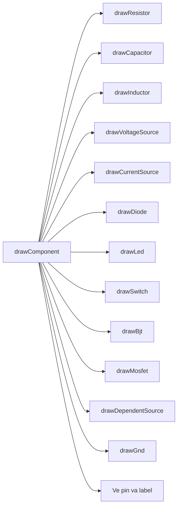

### 4.5 Hit-test va bien doi toa do Canvas

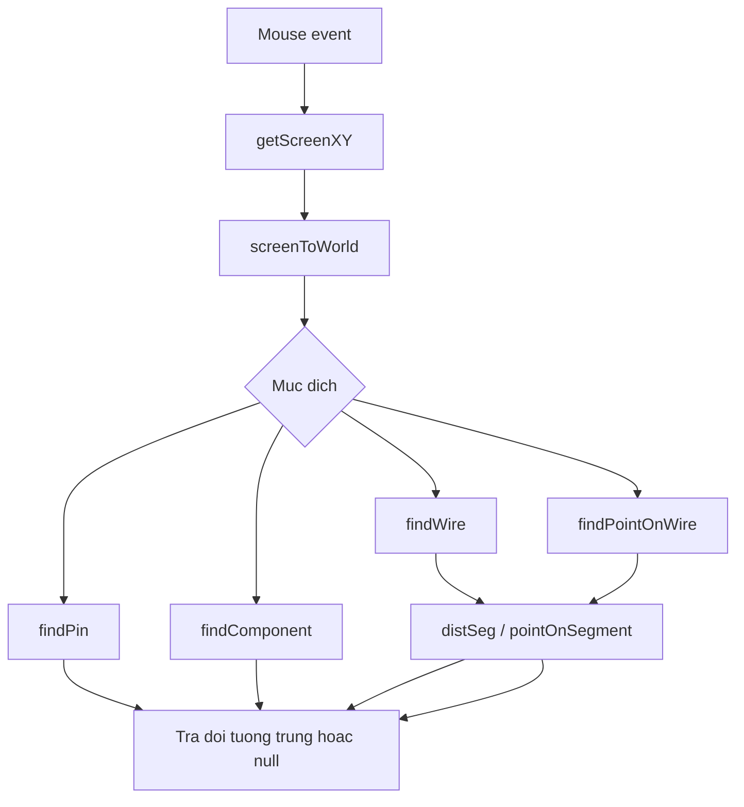

### 4.6 Pan va Zoom trong `useViewport()`

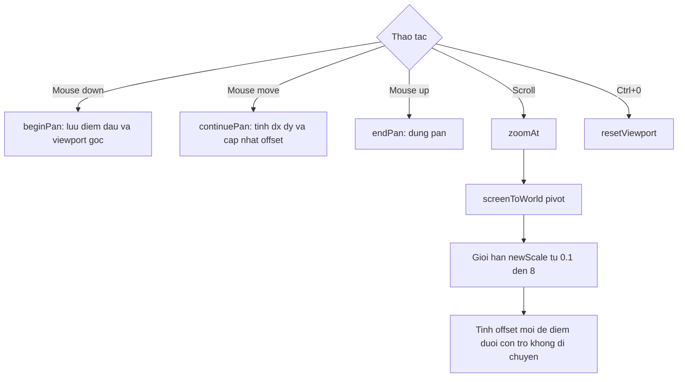

### 4.7 Autosave va quan ly nhieu file mach

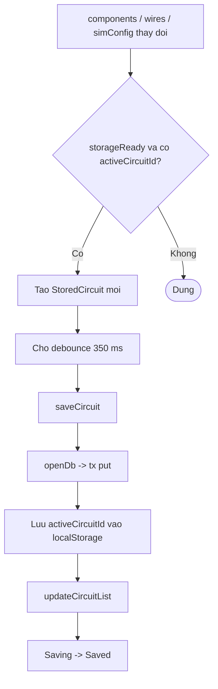

### 4.8 `WaveformPanel` dung du lieu mo phong

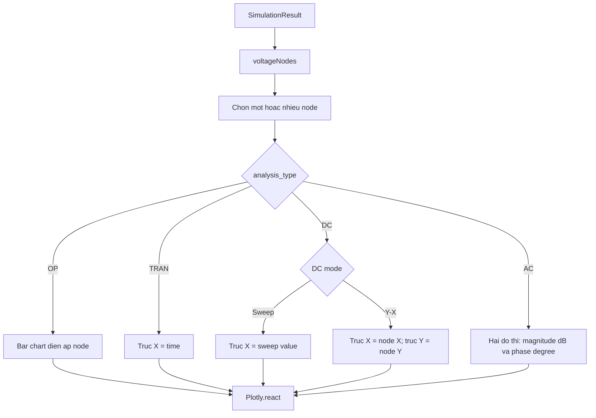

### 4.9 `PropertiesPanel`

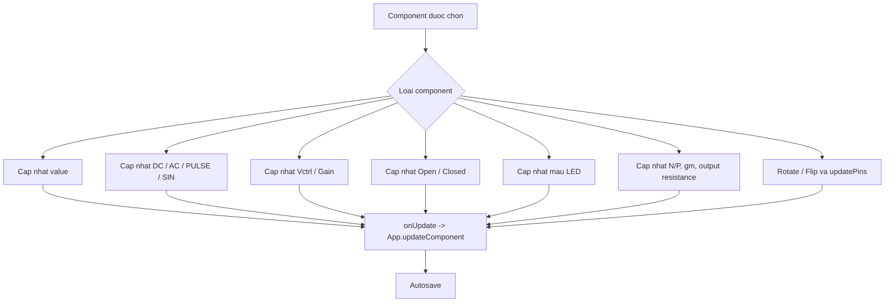

---

## 5. Kien truc du lieu

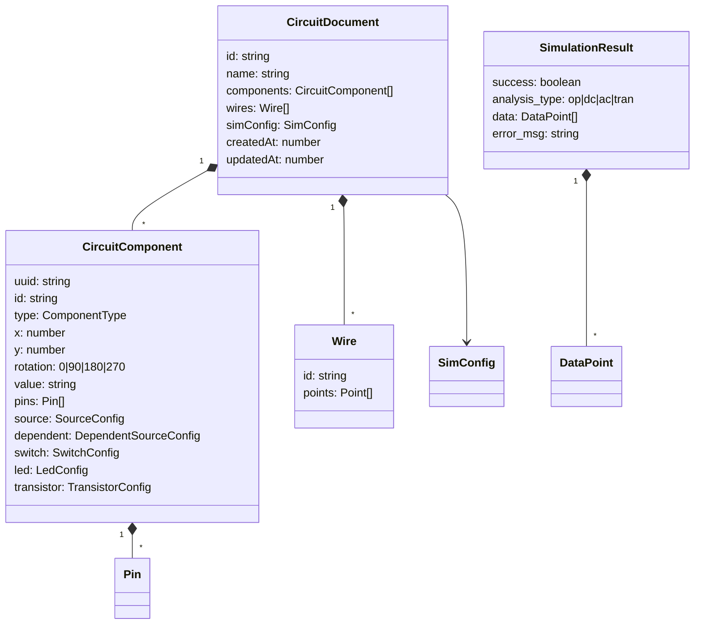

## 6. Luu y ve mo hinh BJT va MOSFET hien tai

BJT va MOSFET dang duoc bien dich thanh mo hinh tuyen tinh ma solver hien tai ho tro:

```text
Iout = gm * Vcontrol
```

Netlist gom mot VCCS va mot dien tro dau ra:

```text
GQ1 collector emitter base emitter gm
RQ1 collector emitter outputResistance
```

Mo hinh nay hoat dong voi OP, DC, AC va TRAN, nhung chua mo phong phi tuyen nhu threshold, cutoff, saturation hoac SPICE transistor model day du.

---

## 7. Ban do ham chi tiet

### `App.tsx`

| Ham | Duoc goi khi | Ket qua |
|---|---|---|
| `log` | Qua trinh mo phong | Them dong vao Console |
| `updateComponent` | Properties thay doi | Cap nhat component dang chon |
| `loadCircuit` | Khoi dong hoac chuyen file | Nap components, wires va simConfig |
| `updateCircuitList` | Sau khi luu | Dua file vua sua len dau danh sach |
| `createNewCircuit` | Nhan nut `+` | Tao va mo file mach moi |
| `renameCurrentCircuit` | Nhan nut `Aa` | Doi ten file hien tai |
| `deleteCurrentCircuit` | Nhan nut xoa file | Xoa file va chuyen sang file con lai |
| `forceSaveCircuit` | Nhan nut Save | Luu file ngay lap tuc |
| `deleteSelectedComponent` | Properties xoa component | Xoa component dang chon |
| `clearSchematic` | Nhan Clear | Xoa schematic va ket qua |
| `startVerticalResize` | Keo Console | Cap nhat chieu cao Console |
| `startHorizontalResize` | Keo Waveform | Cap nhat chieu rong Waveform |
| `runSimulation` | Nhan Run | Sinh netlist, goi solver va hien thi ket qua |

### `Canvas.tsx`

| Nhom ham | Ham | Trach nhiem |
|---|---|---|
| Khoi tao | `snap`, `updatePins`, `defaultValue`, `defaultSource`, `defaultDependent`, `defaultSwitch`, `defaultLed`, `defaultTransistor` | Tao du lieu mac dinh va toa do chan |
| Nhan dang | `componentLabel`, `distSeg`, `pointOnSegment` | Tao label va tinh khoang cach hinh hoc |
| Toa do | `getScreenXY`, `toWorld` | Chuyen toa do mouse sang schematic |
| Ket noi | `computeJunctions` | Tim cac diem noi can ve junction |
| Ve linh kien | `drawGnd`, `drawResistor`, `drawVoltageSource`, `drawCurrentSource`, `drawCapacitor`, `drawInductor`, `drawDiode`, `drawLed`, `drawSwitch`, `drawBjt`, `drawMosfet`, `drawDependentSource` | Ve tung ky hieu schematic |
| Ve tong hop | `drawComponent`, `drawWire`, `drawPreviewWire`, `render` | Ve mot frame canvas hoan chinh |
| Hit-test | `findPin`, `findComponent`, `findWire`, `findPointOnWire` | Tim doi tuong duoi con tro |
| Su kien | `handleMouseDown`, `handleMouseMove`, `handleMouseUp`, `handleWheel`, `handleKeyDown` | Xu ly thao tac nguoi dung |
| Bien doi | `rotateSelectedComponent`, `flipSelectedComponent`, `deleteSelectedComponent` | Bien doi component dang chon |

### `netlist.ts`

| Ham | Trach nhiem |
|---|---|
| `ptKey` | Bien toa do thanh khoa Union-Find |
| `distToSegment` | Kiem tra pin/point co nam tren wire |
| `sourceExpression` | Bien SourceConfig thanh cu phap DC, AC, PULSE hoac SIN |
| `ledModelName` | Tao ten model LED theo mau |
| `ledModelLine` | Tao khai bao `.model` LED |
| `generateNetlist` | Xac dinh node va bien schematic thanh netlist |
| `getNode` | Noi bo trong `generateNetlist`, anh xa pin sang node name |

### `circuitStorage.ts`

| Ham | Trach nhiem |
|---|---|
| `openDb` | Mo hoac khoi tao IndexedDB |
| `tx` | Boc mot thao tac transaction |
| `listCircuits` | Doc va sap xep cac file mach |
| `saveCircuit` | Them/cap nhat file mach |
| `deleteCircuit` | Xoa file mach |
| `createCircuit` | Tao document mach moi |
| `getActiveCircuitId` | Doc file dang mo tu localStorage |

### `circuitEngine.ts`

| Ham / lop | Trach nhiem |
|---|---|
| `loadEngine` | Tai JavaScript glue va WASM solver |
| `getEngine` | Tra singleton engine |
| `CircuitEngine.simulate` | Gui netlist vao WASM va parse JSON |
| `CircuitEngine.voltages` | Lay dien ap OP |
| `CircuitEngine.currents` | Lay dong nhanh OP |
| `CircuitEngine.tranSeries` | Lay chuoi du lieu theo thoi gian |
| `CircuitEngine.acBode` | Tinh magnitude dB va phase |

### Cac module giao dien khac

| Module | Ham chinh | Trach nhiem |
|---|---|---|
| `Toolbar.tsx` | `openModal`, `apply`, `set` | Chinh analysis mode va dieu khien chuong trinh |
| `Sidebar.tsx` | `ToolIcon`, `toggle`, `choose` | Chon component tu thanh nhanh hoac library |
| `PropertiesPanel.tsx` | `update`, `updateSource`, `updateDependent`, `updateSwitch`, `updateLedColor`, `updateTransistor`, `rotate`, `flipX`, `flipY` | Chinh thuoc tinh component |
| `WaveformPanel.tsx` | `voltageNodes` va effect dung Plotly | Chon node va ve cac loai waveform |
| `useViewport.ts` | `screenToWorld`, `worldToScreen`, `beginPan`, `continuePan`, `endPan`, `zoomAt`, `resetViewport` | Quan ly camera schematic |
| `unionFind.ts` | `find`, `union` | Gom cac diem noi thanh cung mot node dien |

---

## 8. Kien truc Circuit Engine

### 8.1 Vi tri cua engine trong he thong

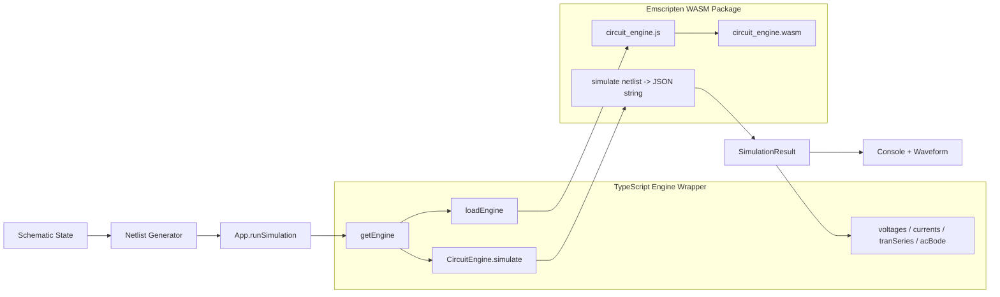

Engine chay hoan toan trong trinh duyet. Trinh duyet khong gui netlist den server, do do viec mo phong van hoat dong sau khi trang va hai file WASM da duoc tai.

### 8.2 Hop dong API giua React va WASM

Frontend chi su dung mot ham cua WASM:

```ts
simulate(netlist: string): string
```

Du lieu vao la netlist dang text. Du lieu tra ve la JSON string, sau do wrapper chuyen thanh:

```ts
interface SimulationResult {
  success: boolean;
  error_msg: string;
  analysis_type: 'op' | 'dc' | 'ac' | 'tran';
  node_map: Record<string, number>;
  data: DataPoint[];
}
```

Moi `DataPoint` dai dien cho mot diem operating point, sweep, tan so hoac thoi gian:

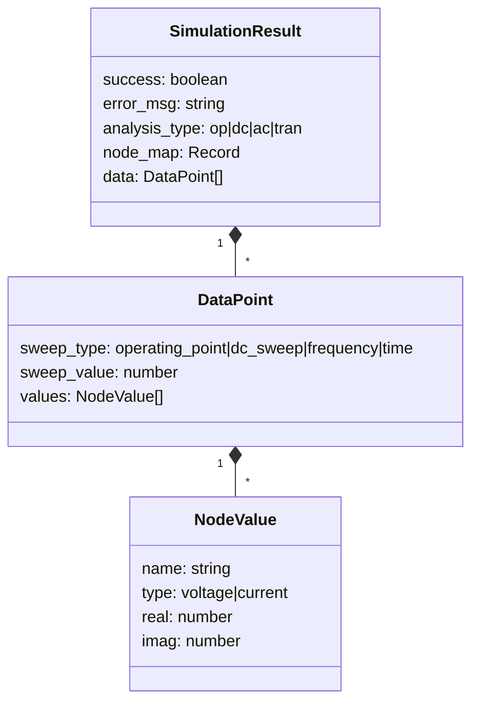

### 8.3 Flowchart nap engine

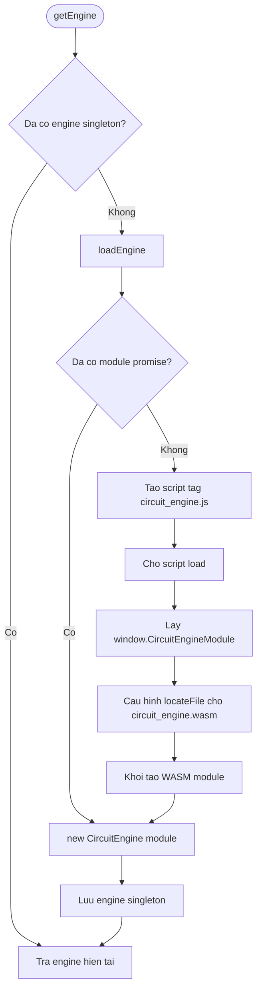

`_modulePromise` ngan viec tai WASM trung lap. `_engineSingleton` dam bao moi lan Run deu tai su dung cung mot engine.

### 8.4 Flowchart goi mo phong

```mermaid
sequenceDiagram
    actor User
    participant Toolbar
    participant App
    participant Netlist as generateNetlist
    participant Wrapper as CircuitEngine.ts
    participant WASM as circuit_engine.wasm
    participant Waveform

    User->>Toolbar: Nhan Run
    Toolbar->>App: onRun()
    App->>Netlist: generateNetlist(components, wires)
    Netlist-->>App: SPICE-like netlist
    App->>App: Chen lenh .op/.dc/.ac/.tran
    App->>Wrapper: getEngine()
    Wrapper-->>App: CircuitEngine singleton
    App->>Wrapper: simulate(netlist)
    Wrapper->>WASM: mod.simulate(netlist)
    WASM-->>Wrapper: JSON string
    Wrapper-->>App: SimulationResult

    alt success = true
        App->>Waveform: result
        Waveform->>Waveform: Chuyen data thanh Plotly traces
    else success = false
        App->>App: Ghi error_msg vao Console
    end
```

### 8.5 Luong xu ly noi bo solver

> Luu y: source C++ cua engine khong nam trong project hien tai. Flowchart duoi day la mo hinh suy luan dua tren API, cu phap netlist duoc chap nhan va cac loi solver tra ve nhu `Singular matrix`. Khi co source engine, can doi chieu lai tung buoc.

```mermaid
flowchart TD
    START([simulate netlist])
    PARSE[Doc tung dong netlist]
    CLASSIFY{Loai dong}
    MODEL[Luu khai bao .model]
    ELEMENT[Tao danh sach phan tu mach]
    COMMAND[Luu lenh .op / .dc / .ac / .tran]
    NODES[Tao node map va bien nhanh]
    VALIDATE[Kiem tra model, node va tham so]
    VALID{Hop le?}
    ANALYSIS{Loai phan tich}
    OP[Giai operating point]
    DC[Quet nguon va giai tai moi diem]
    AC[Giai he so phuc tai moi tan so]
    TRAN[Tien theo tung buoc thoi gian]
    MATRIX[Lap he phuong trinh mach]
    SOLVE[Giai he tuyen tinh]
    CHECK{Ma tran giai duoc?}
    DATA[Tao DataPoint va NodeValue]
    JSON[Dong goi SimulationResult thanh JSON]
    ERROR[Tra success=false va error_msg]

    START --> PARSE --> CLASSIFY
    CLASSIFY -- Model --> MODEL --> PARSE
    CLASSIFY -- Element --> ELEMENT --> PARSE
    CLASSIFY -- Command --> COMMAND --> NODES
    NODES --> VALIDATE --> VALID
    VALID -- Khong --> ERROR
    VALID -- Co --> ANALYSIS

    ANALYSIS -- OP --> OP --> MATRIX
    ANALYSIS -- DC --> DC --> MATRIX
    ANALYSIS -- AC --> AC --> MATRIX
    ANALYSIS -- TRAN --> TRAN --> MATRIX

    MATRIX --> SOLVE --> CHECK
    CHECK -- Khong --> ERROR
    CHECK -- Co --> DATA
    DATA -->|Con diem sweep / tan so / thoi gian| MATRIX
    DATA -->|Hoan tat| JSON
```

### 8.6 Luong giai theo tung che do

#### Operating Point `.OP`

```mermaid
flowchart TD
    START([.OP])
    STAMP[Dong gop tung linh kien vao ma tran]
    SOLVE[Giai he phuong trinh]
    OK{Giai duoc?}
    VALUES[Lay dien ap node va dong nhanh]
    RESULT[Tra mot DataPoint operating_point]
    ERROR[Tra loi singular matrix / model / parser]

    START --> STAMP --> SOLVE --> OK
    OK -- Co --> VALUES --> RESULT
    OK -- Khong --> ERROR
```

#### DC Sweep `.DC`

```mermaid
flowchart TD
    START([.DC source start stop step])
    VALUE[Dat gia tri nguon sweep]
    STAMP[Lap lai he phuong trinh]
    SOLVE[Giai tai diem sweep hien tai]
    SAVE[Luu DataPoint dc_sweep]
    NEXT{Con gia tri sweep?}
    RESULT[Tra danh sach DataPoint]

    START --> VALUE --> STAMP --> SOLVE --> SAVE --> NEXT
    NEXT -- Co --> VALUE
    NEXT -- Khong --> RESULT
```

#### AC Analysis `.AC`

```mermaid
flowchart TD
    START([.AC scale points fstart fstop])
    FREQ[Tao danh sach tan so]
    SOURCE[Lay bien do va pha AC cua nguon]
    COMPLEX[Lap he phuong trinh so phuc tai tan so hien tai]
    SOLVE[Giai real va imaginary]
    SAVE[Luu DataPoint frequency]
    NEXT{Con tan so?}
    RESULT[Tra magnitude va phase thong qua NodeValue]

    START --> FREQ --> SOURCE --> COMPLEX --> SOLVE --> SAVE --> NEXT
    NEXT -- Co --> COMPLEX
    NEXT -- Khong --> RESULT
```

#### Transient Analysis `.TRAN`

```mermaid
flowchart TD
    START([.TRAN step stop])
    TIME[t = 0]
    SOURCES[Tinh nguon PULSE / SIN tai t]
    DYNAMIC[Cap nhat trang thai C va L]
    MATRIX[Lap he phuong trinh tai t]
    SOLVE[Giai dien ap va dong]
    SAVE[Luu DataPoint time]
    NEXT[t = t + step]
    DONE{t > stop?}
    RESULT[Tra chuoi du lieu thoi gian]

    START --> TIME --> SOURCES --> DYNAMIC --> MATRIX --> SOLVE --> SAVE --> NEXT --> DONE
    DONE -- Chua --> SOURCES
    DONE -- Roi --> RESULT
```

### 8.7 Anh xa linh kien giao dien sang phan tu engine

| Linh kien tren schematic | Netlist gui vao engine | Ghi chu |
|---|---|---|
| Resistor | `R... n1 n2 value` | Phan tu tuyen tinh |
| Capacitor | `C... n1 n2 value` | Phu thuoc tan so/thoi gian |
| Inductor | `L... n1 n2 value` | Phu thuoc tan so/thoi gian |
| Voltage Source | `V... n+ n- expression` | DC, AC, PULSE, SIN |
| Current Source | `I... n+ n- expression` | DC, AC, PULSE, SIN |
| VCVS | `E...` | Nguon ap phu thuoc ap |
| CCCS | `F...` | Nguon dong phu thuoc dong |
| VCCS | `G...` | Nguon dong phu thuoc ap |
| CCVS | `H...` | Nguon ap phu thuoc dong |
| Diode | `D... model` | Can khai bao `.model` truoc |
| LED | `D... Dled_color` | Duoc bien dich thanh diode model |
| Switch | `R... 1m` hoac `R... 1e12` | Mo hinh hoa bang dien tro |
| Ideal BJT | `G...` + `R...` | Bien dich thanh VCCS va output resistance |
| Ideal MOSFET | `G...` + `R...` | Bien dich thanh VCCS va output resistance |
| Ground | Node `0` | Khong sinh element line |

### 8.8 Xu ly ket qua engine

```mermaid
flowchart TD
    RES[SimulationResult]
    OK{success?}
    ERROR[Console hien error_msg]
    TYPE{analysis_type}
    OP[voltages + currents]
    DC[DC sweep hoac Y-X plot]
    AC[acBode: magnitude dB va phase]
    TRAN[tranSeries hoac waveform theo time]
    CONSOLE[In bang mau du lieu]
    PLOT[Plotly waveform]

    RES --> OK
    OK -- Khong --> ERROR
    OK -- Co --> TYPE
    TYPE -- op --> OP --> CONSOLE
    TYPE -- dc --> DC --> CONSOLE
    TYPE -- dc --> DC --> PLOT
    TYPE -- ac --> AC --> CONSOLE
    TYPE -- ac --> AC --> PLOT
    TYPE -- tran --> TRAN --> CONSOLE
    TYPE -- tran --> TRAN --> PLOT
```

### 8.9 Cac loai loi engine can xu ly

| Loi | Nguyen nhan thuong gap | Cach xu ly o giao dien |
|---|---|---|
| Unknown model | Linh kien tham chieu model chua khai bao | Sinh `.model` truoc element |
| Singular matrix | Node floating, mach ho, short nguon ly tuong | Dat GND, auto-reference hoac sua mach |
| Parse/model error | Netlist sai cu phap hoac tham so khong hop le | Hien `error_msg` trong Console |
| WASM load error | Khong tai duoc `.js` hoac `.wasm` | Bat exception tu `loadEngine` |
| Simulation exception | WASM call nem exception | Bat trong `runSimulation` va ghi Console |

### 8.10 Gioi han va huong nang cap engine

Engine hien tai la mot binary WASM dong goi san; project khong co source solver de sua truc tiep. Vi vay:

- Co the them linh kien moi bang cach bien dich sang cac phan tu engine da ho tro.
- Khong the bo sung model phi tuyen BJT/MOSFET day du neu khong co source engine hoac thay engine.
- BJT/MOSFET hien tai la mo hinh tuyen tinh `Iout = gm * Vcontrol`.
- Viec debug solver chi dua vao netlist vao va `error_msg` tra ve.

Kien truc de nang cap trong tuong lai:

```mermaid
flowchart LR
    APP[React App]
    PORT[SimulationEngine interface]
    CURRENT[Current WASM Adapter]
    NG[ngspice WASM Adapter]
    TEST[Engine Contract Tests]

    APP --> PORT
    PORT --> CURRENT
    PORT -. Lua chon nang cap .-> NG
    TEST --> PORT
```

Nen tao interface chung:

```ts
interface SimulationEngine {
  simulate(netlist: string): Promise<SimulationResult>;
}
```

Khi do co the thay solver hien tai bang ngspice WASM ma khong can sua Canvas, Properties, storage hoac Waveform.
