# KIEN TRUC HE THONG VA SO DO THUAT TOAN CIRCUITTH

Tai lieu nay mo ta kien truc va luong xu ly cua CircuitTH theo code hien tai.

## 1. Kien truc he thong

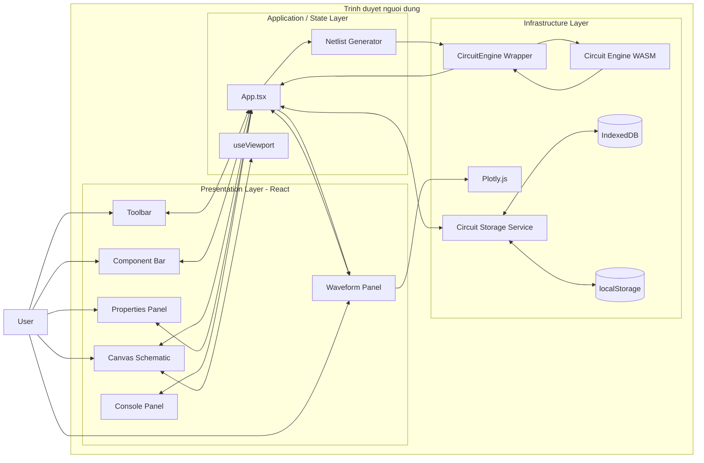

### Phan tach trach nhiem

| Tang | Module chinh | Trach nhiem |
|---|---|---|
| Giao dien | `Toolbar`, `Sidebar`, `Canvas`, `PropertiesPanel`, `WaveformPanel` | Nhan thao tac va hien thi |
| Dieu phoi | `App.tsx` | Quan ly state, file mach, cau hinh va mo phong |
| Do hoa schematic | `Canvas.tsx`, `useViewport.ts` | Ve, hit-test, pan, zoom, dat linh kien va day |
| Bien dich mach | `netlist.ts`, `unionFind.ts` | Xac dinh node dien va sinh netlist |
| Giai mach | `circuitEngine.ts`, WASM | Chay OP, DC, AC, TRAN |
| Truc quan hoa | `WaveformPanel.tsx`, Plotly | Ve OP, DC Sweep, DC Y-X, Bode va Transient |
| Luu tru | `circuitStorage.ts` | Autosave va quan ly nhieu file mach trong IndexedDB |

---

## 2. Flowchart muc 1 - Tong quan chuong trinh

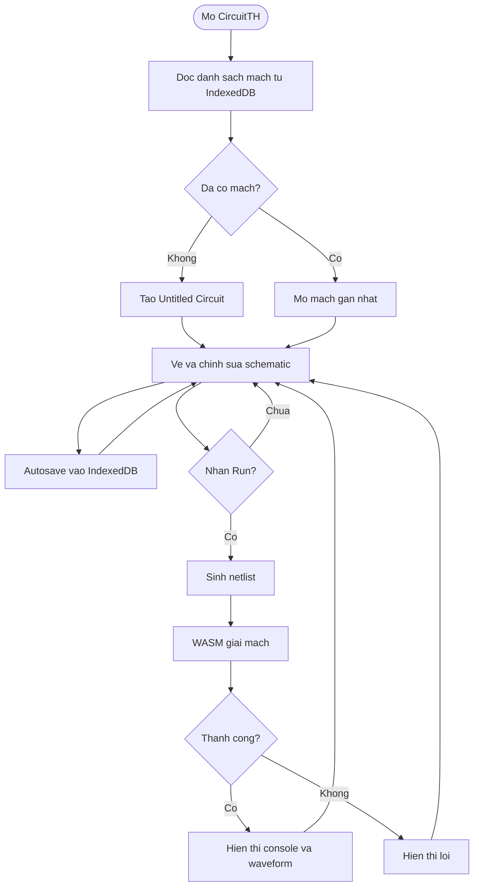

---

## 3. Flowchart muc 2 - Theo muc goi ham

### 3.1 Khoi dong va luu file mach

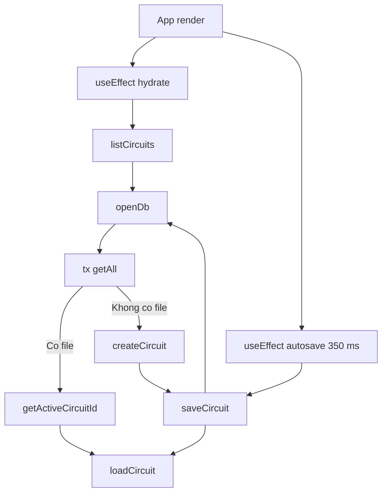

### 3.2 Chinh sua schematic

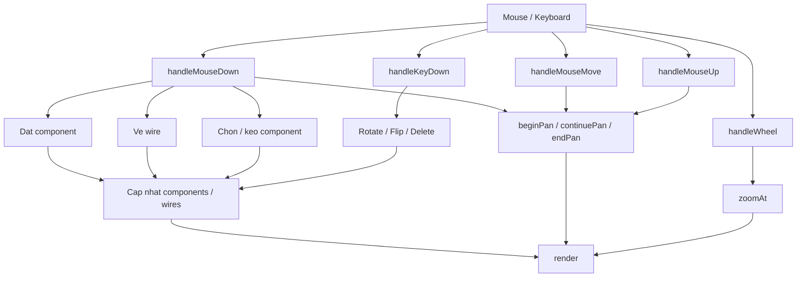

### 3.3 Chay mo phong

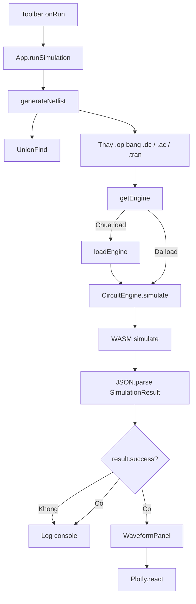

### 3.4 Quan he cac component React

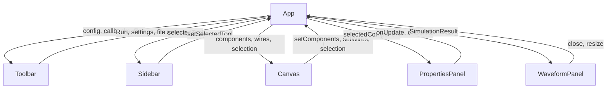

---

## 4. Flowchart muc 3 - Chi tiet tung nhom ham

### 4.1 `App.runSimulation()`

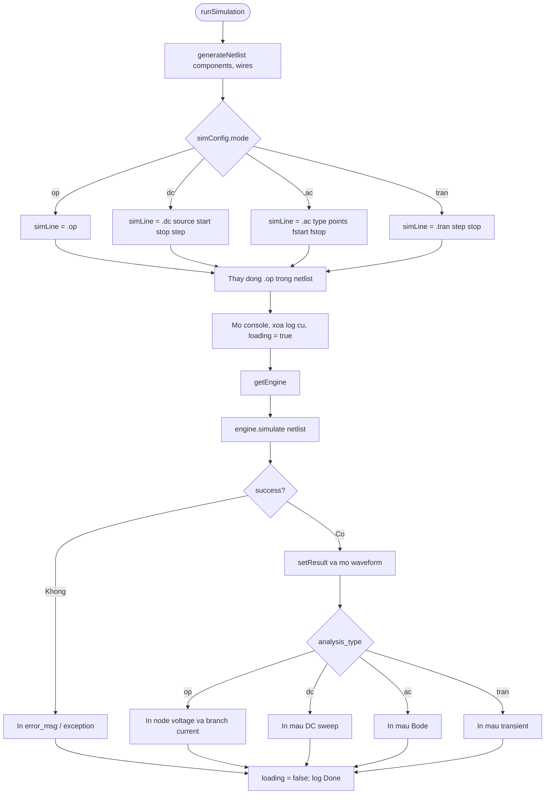

### 4.2 `generateNetlist()`

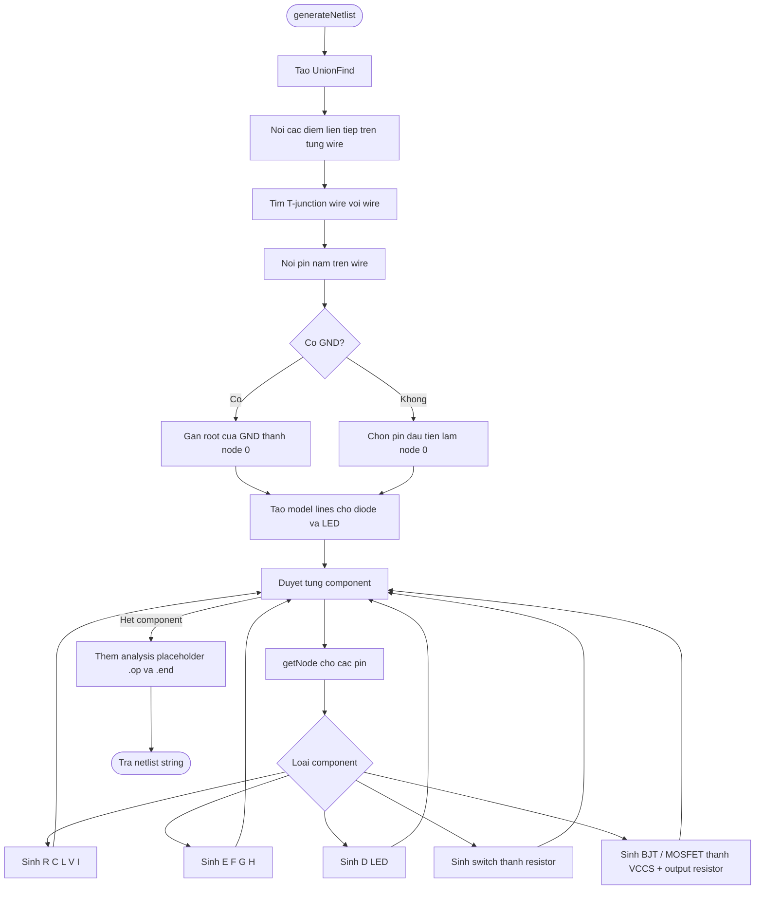

### 4.3 `Canvas.handleMouseDown()`

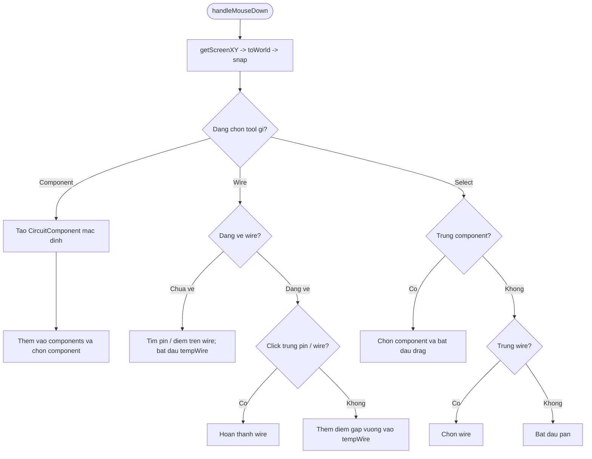

### 4.4 `Canvas.render()`


`drawComponent()` dieu phoi cac ham ve:

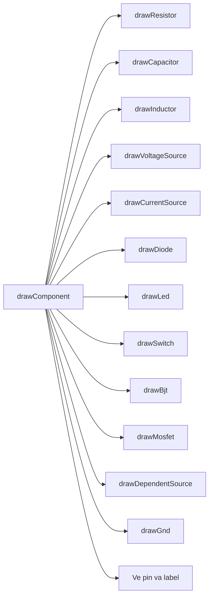

### 4.5 Hit-test va bien doi toa do Canvas

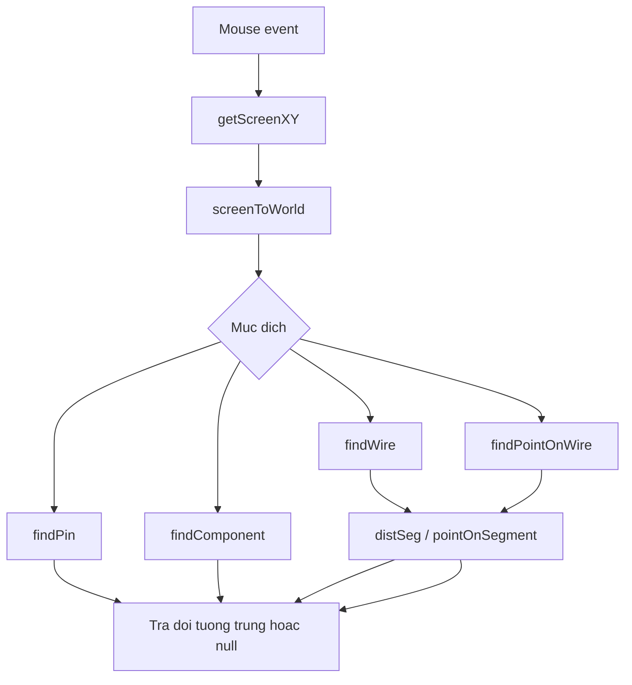

### 4.6 Pan va Zoom trong `useViewport()`

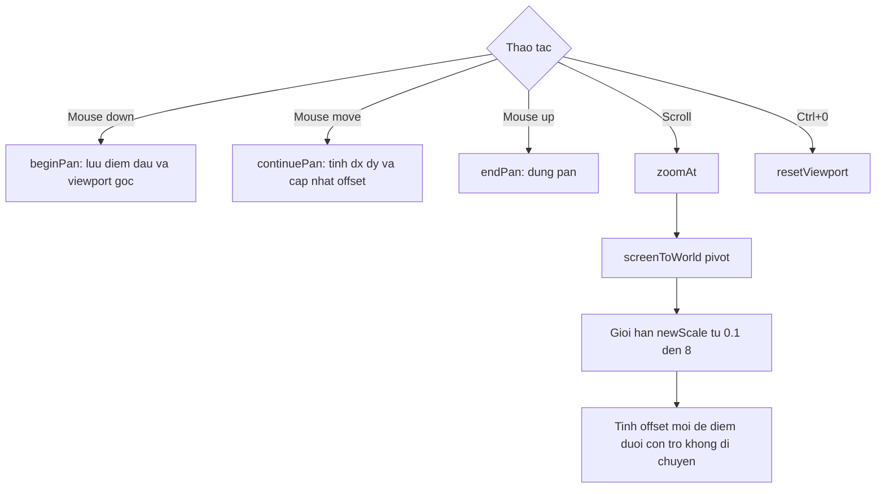

### 4.7 Autosave va quan ly nhieu file mach


### 4.8 `WaveformPanel` dung du lieu mo phong

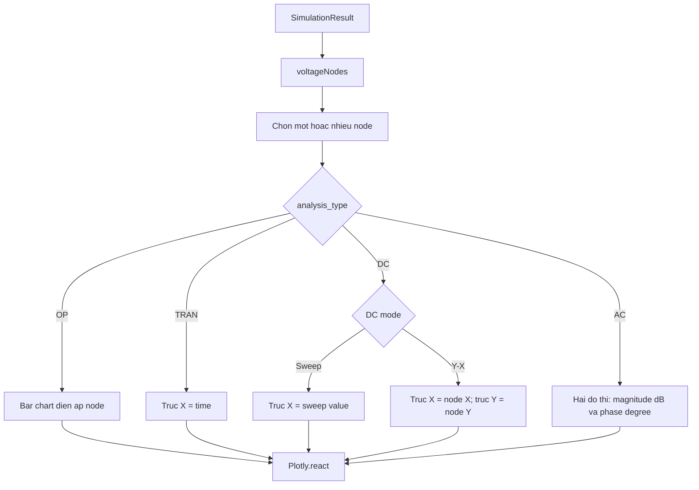

### 4.9 `PropertiesPanel`

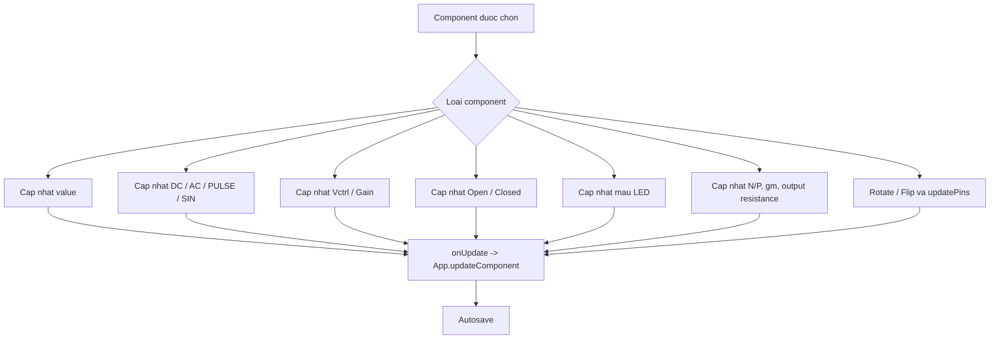

---

## 5. Kien truc du lieu

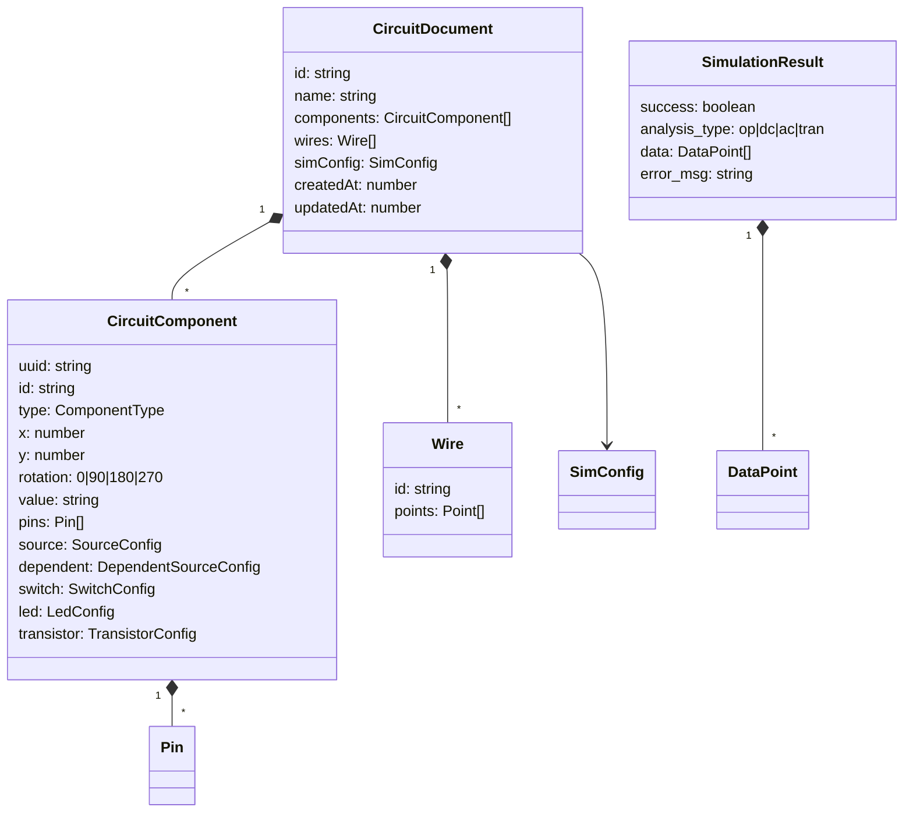

## 6. Luu y ve mo hinh BJT va MOSFET hien tai

BJT va MOSFET dang duoc bien dich thanh mo hinh tuyen tinh ma solver hien tai ho tro:

```text
Iout = gm * Vcontrol
```

Netlist gom mot VCCS va mot dien tro dau ra:

```text
GQ1 collector emitter base emitter gm
RQ1 collector emitter outputResistance
```

Mo hinh nay hoat dong voi OP, DC, AC va TRAN, nhung chua mo phong phi tuyen nhu threshold, cutoff, saturation hoac SPICE transistor model day du.

---

## 7. Ban do ham chi tiet

### `App.tsx`

| Ham | Duoc goi khi | Ket qua |
|---|---|---|
| `log` | Qua trinh mo phong | Them dong vao Console |
| `updateComponent` | Properties thay doi | Cap nhat component dang chon |
| `loadCircuit` | Khoi dong hoac chuyen file | Nap components, wires va simConfig |
| `updateCircuitList` | Sau khi luu | Dua file vua sua len dau danh sach |
| `createNewCircuit` | Nhan nut `+` | Tao va mo file mach moi |
| `renameCurrentCircuit` | Nhan nut `Aa` | Doi ten file hien tai |
| `deleteCurrentCircuit` | Nhan nut xoa file | Xoa file va chuyen sang file con lai |
| `forceSaveCircuit` | Nhan nut Save | Luu file ngay lap tuc |
| `deleteSelectedComponent` | Properties xoa component | Xoa component dang chon |
| `clearSchematic` | Nhan Clear | Xoa schematic va ket qua |
| `startVerticalResize` | Keo Console | Cap nhat chieu cao Console |
| `startHorizontalResize` | Keo Waveform | Cap nhat chieu rong Waveform |
| `runSimulation` | Nhan Run | Sinh netlist, goi solver va hien thi ket qua |

### `Canvas.tsx`

| Nhom ham | Ham | Trach nhiem |
|---|---|---|
| Khoi tao | `snap`, `updatePins`, `defaultValue`, `defaultSource`, `defaultDependent`, `defaultSwitch`, `defaultLed`, `defaultTransistor` | Tao du lieu mac dinh va toa do chan |
| Nhan dang | `componentLabel`, `distSeg`, `pointOnSegment` | Tao label va tinh khoang cach hinh hoc |
| Toa do | `getScreenXY`, `toWorld` | Chuyen toa do mouse sang schematic |
| Ket noi | `computeJunctions` | Tim cac diem noi can ve junction |
| Ve linh kien | `drawGnd`, `drawResistor`, `drawVoltageSource`, `drawCurrentSource`, `drawCapacitor`, `drawInductor`, `drawDiode`, `drawLed`, `drawSwitch`, `drawBjt`, `drawMosfet`, `drawDependentSource` | Ve tung ky hieu schematic |
| Ve tong hop | `drawComponent`, `drawWire`, `drawPreviewWire`, `render` | Ve mot frame canvas hoan chinh |
| Hit-test | `findPin`, `findComponent`, `findWire`, `findPointOnWire` | Tim doi tuong duoi con tro |
| Su kien | `handleMouseDown`, `handleMouseMove`, `handleMouseUp`, `handleWheel`, `handleKeyDown` | Xu ly thao tac nguoi dung |
| Bien doi | `rotateSelectedComponent`, `flipSelectedComponent`, `deleteSelectedComponent` | Bien doi component dang chon |

### `netlist.ts`

| Ham | Trach nhiem |
|---|---|
| `ptKey` | Bien toa do thanh khoa Union-Find |
| `distToSegment` | Kiem tra pin/point co nam tren wire |
| `sourceExpression` | Bien SourceConfig thanh cu phap DC, AC, PULSE hoac SIN |
| `ledModelName` | Tao ten model LED theo mau |
| `ledModelLine` | Tao khai bao `.model` LED |
| `generateNetlist` | Xac dinh node va bien schematic thanh netlist |
| `getNode` | Noi bo trong `generateNetlist`, anh xa pin sang node name |

### `circuitStorage.ts`

| Ham | Trach nhiem |
|---|---|
| `openDb` | Mo hoac khoi tao IndexedDB |
| `tx` | Boc mot thao tac transaction |
| `listCircuits` | Doc va sap xep cac file mach |
| `saveCircuit` | Them/cap nhat file mach |
| `deleteCircuit` | Xoa file mach |
| `createCircuit` | Tao document mach moi |
| `getActiveCircuitId` | Doc file dang mo tu localStorage |

### `circuitEngine.ts`

| Ham / lop | Trach nhiem |
|---|---|
| `loadEngine` | Tai JavaScript glue va WASM solver |
| `getEngine` | Tra singleton engine |
| `CircuitEngine.simulate` | Gui netlist vao WASM va parse JSON |
| `CircuitEngine.voltages` | Lay dien ap OP |
| `CircuitEngine.currents` | Lay dong nhanh OP |
| `CircuitEngine.tranSeries` | Lay chuoi du lieu theo thoi gian |
| `CircuitEngine.acBode` | Tinh magnitude dB va phase |

### Cac module giao dien khac

| Module | Ham chinh | Trach nhiem |
|---|---|---|
| `Toolbar.tsx` | `openModal`, `apply`, `set` | Chinh analysis mode va dieu khien chuong trinh |
| `Sidebar.tsx` | `ToolIcon`, `toggle`, `choose` | Chon component tu thanh nhanh hoac library |
| `PropertiesPanel.tsx` | `update`, `updateSource`, `updateDependent`, `updateSwitch`, `updateLedColor`, `updateTransistor`, `rotate`, `flipX`, `flipY` | Chinh thuoc tinh component |
| `WaveformPanel.tsx` | `voltageNodes` va effect dung Plotly | Chon node va ve cac loai waveform |
| `useViewport.ts` | `screenToWorld`, `worldToScreen`, `beginPan`, `continuePan`, `endPan`, `zoomAt`, `resetViewport` | Quan ly camera schematic |
| `unionFind.ts` | `find`, `union` | Gom cac diem noi thanh cung mot node dien |
